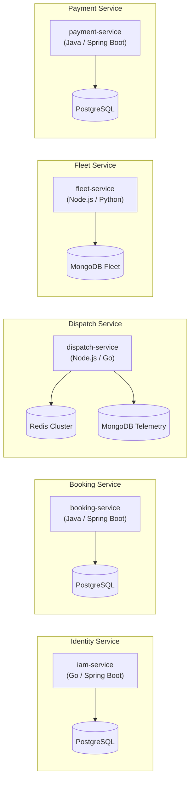
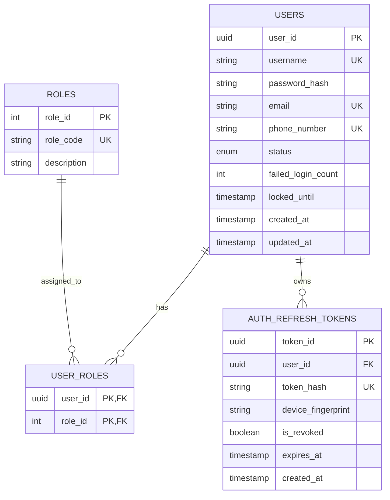
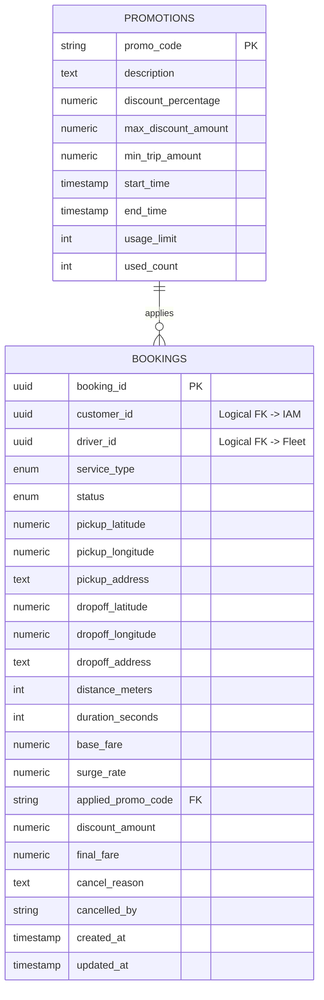
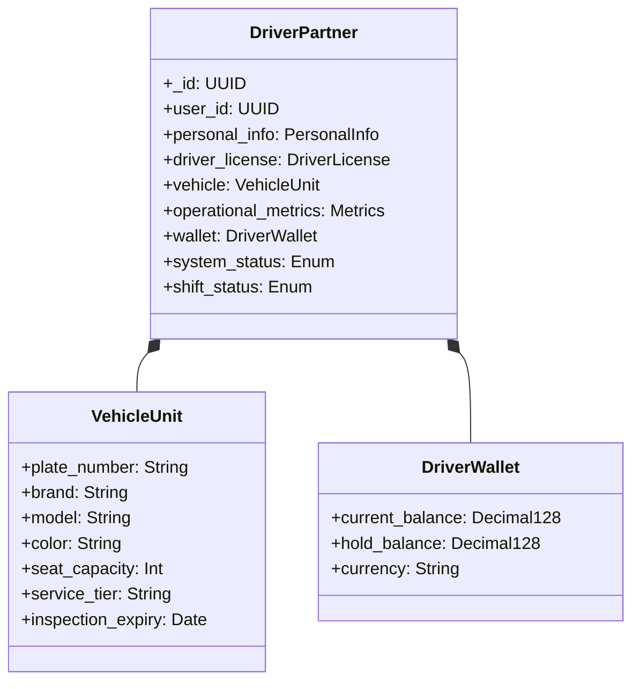
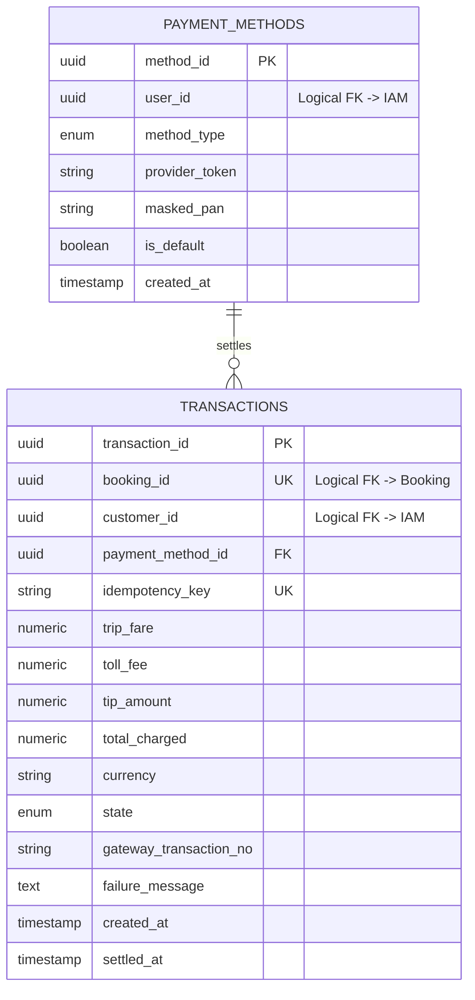
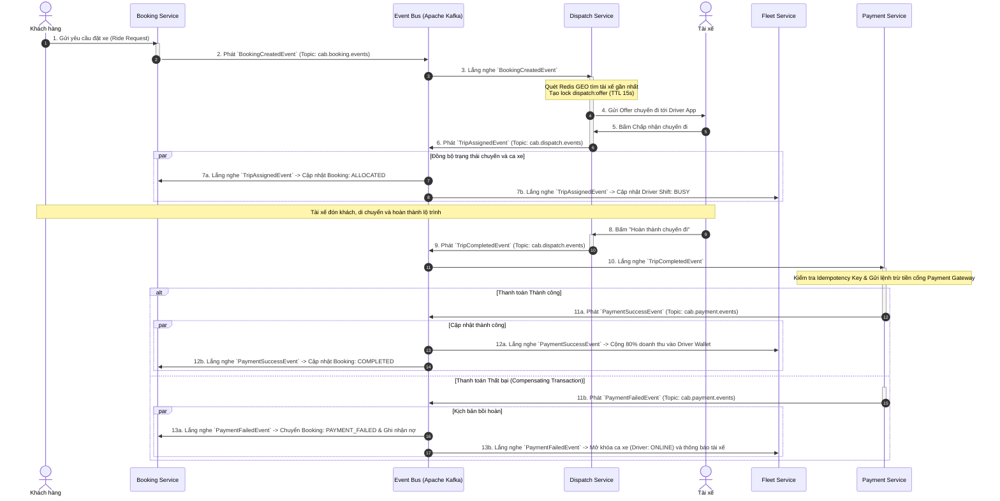

# CABSYSTEM - KIẾN TRÚC HỆ THỐNG MICROSERVICES & DOMAIN-DRIVEN DESIGN

---

## 1. Phân rã 5 Bounded Contexts & Context Mapping

Hệ thống đặt xe công nghệ (CABSYSTEM) được phân rã theo phương pháp Domain-Driven Design (DDD) thành 5 Bounded Contexts (BC) độc lập, giải quyết các bài toán nghiệp vụ chuyên biệt:

1. **Identity & Access BC:** Chịu trách nhiệm xác thực, cấp quyền, quản lý tài khoản người dùng (Khách hàng, Tài xế, Quản trị viên) và quản lý phiên làm việc.
2. **Trip Booking BC:** Quản lý vòng đời yêu cầu đặt xe, tính toán cước phí ước tính, áp dụng khuyến mãi và giám sát máy trạng thái của chuyến đi.
3. **Dispatch & Tracking BC:** Quét tài xế lân cận theo thời gian thực (Geospatial Matching), phát cuốc xe, duy trì khóa điều phối và thu thập tọa độ lộ trình GPS di chuyển.
4. **Driver & Fleet BC:** Quản lý hồ sơ xe, giấy phép kinh doanh vận tải, kiểm soát ca hoạt động (Shift) và quản lý ví số dư nội bộ của tài xế (Payout Wallet).
5. **Payment & Billing BC:** Xử lý thanh toán số, liên kết cổng thanh toán thẻ/ví điện tử, phong tỏa hạn mức (Pre-authorization), trừ tiền hoàn tất chuyến đi và đối soát doanh thu.

### Bản đồ quan hệ ngữ cảnh (Context Map)

```mermaid
graph TB
    subgraph Clients["Lớp Client"]
        CA["Customer Mobile App"]
        DA["Driver Mobile App"]
    end

    subgraph Gateway["Lớp API Gateway"]
        GW["API Gateway (Kong / Ocelot)"]
    end

    subgraph Contexts["5 Bounded Contexts (Microservices)"]
        BC_IAM["1. Identity & Access BC<br/>(PostgreSQL)"]
        BC_BOOKING["2. Trip Booking BC<br/>(PostgreSQL)"]
        BC_DISPATCH["3. Dispatch & Tracking BC<br/>(Redis + MongoDB)"]
        BC_FLEET["4. Driver & Fleet BC<br/>(MongoDB)"]
        BC_PAYMENT["5. Payment & Billing BC<br/>(PostgreSQL)"]
    end

    subgraph EventStream["Event Streaming (Apache Kafka)"]
        K_BOOK["Topic: cab.booking.events"]
        K_DISP["Topic: cab.dispatch.events"]
        K_PAY["Topic: cab.payment.events"]
    end

    CA -->|REST / HTTPS| GW
    DA -->|WSS / HTTPS| GW

    GW -->|REST / gRPC| BC_IAM
    GW -->|REST / gRPC| BC_BOOKING
    GW -->|WebSocket / gRPC| BC_DISPATCH
    GW -->|REST| BC_PAYMENT
    GW -->|REST| BC_FLEET

    BC_IAM -.->|Cung cấp Identity Claims (Upstream)| BC_BOOKING
    BC_IAM -.->|Cung cấp Identity Claims (Upstream)| BC_FLEET

    BC_BOOKING -->|Publish: BookingCreatedEvent| K_BOOK
    K_BOOK -->|Consume| BC_DISPATCH

    BC_DISPATCH -->|Publish: TripAssigned, TripCompleted| K_DISP
    K_DISP -->|Consume: TripAssigned| BC_FLEET
    K_DISP -->|Consume: TripAssigned, TripCompleted| BC_BOOKING
    K_DISP -->|Consume: TripCompleted| BC_PAYMENT

    BC_PAYMENT -->|Publish: PaymentSuccess, PaymentFailed| K_PAY
    K_PAY -->|Consume: PaymentSuccess| BC_FLEET
    K_PAY -->|Consume: PaymentSuccess| BC_BOOKING

    BC_DISPATCH -.->|Sync RPC/In-Memory Query| BC_FLEET
```

### Chiến lược tích hợp liên ngữ cảnh (Context Mapping Relationships)
- **IAM BC $\rightarrow$ Các BC khác (Customer/Supplier - Conformance):** IAM đóng vai trò Upstream cung cấp Identity Context qua JWT Claims chứa `user_id`, `roles` để các BC Downstream giải mã độc lập mà không cần truy vấn ngược.
- **Booking BC $\leftrightarrow$ Dispatch BC (Asynchronous Event-Driven):** Tương tác bất đồng bộ thông qua Apache Kafka để chịu tải đột biến (Surge traffic) khi số lượng người đặt xe cùng lúc tăng vọt.
- **Dispatch BC $\rightarrow$ Payment & Fleet BC (Choreography):** Giao tiếp dựa trên sự kiện khi chuyến xe kết thúc (`TripCompletedEvent`), kích hoạt song song trừ tiền khách và ghi nhận công nợ cho tài xế.

---

## 2. Từ điển Ubiquitous Language (Ngôn ngữ chung)

| **Bounded Context** | **Thuật ngữ (Ubiquitous Term)** | **Ý nghĩa Nghiệp vụ & Kỹ thuật chi tiết** |
| :--- | :--- | :--- |
| **IAM** | **Subject Principal** | Thực thể định danh bảo mật sau khi xác thực thành công, mang bộ quyền hợp lệ (`Customer`, `Driver`, `Admin`). |
| | **Credential Secret** | Bí mật xác thực người dùng bao gồm chuỗi băm mật khẩu (Argon2id/Bcrypt) hoặc Refresh Token xoay vòng (Rotational Token). |
| **Booking** | **Fare Quote** | Bản báo giá tạm tính (hiệu lực trong 5 phút) gồm cước cơ bản, phụ phí thời gian, hệ số Surge và mã giảm giá đã áp dụng. |
| | **Waypoint** | Điểm mốc hành trình địa lý gồm tọa độ GPS (Vĩ độ/Kinh độ) và tên địa chỉ chuẩn hóa (Reverse-Geocoded address). |
| | **Ride Booking** | Bản ghi yêu cầu chuyến xe do hành khách khởi tạo, điều khiển bởi máy trạng thái hữu hạn (*Draft* $\rightarrow$ *Requested* $\rightarrow$ *Allocated* $\rightarrow$ *On_Trip* $\rightarrow$ *Completed* / *Cancelled*). |
| **Dispatch** | **Geo-Radius Batch** | Vùng không gian quét tập hợp tài xế lân cận điểm đón bằng thuật toán không gian (Redis GEO / H3 Hexagonal Index). |
| | **Offer Dispatch** | Lượt điều phối chuyến đi được gán độc quyền cho một tài xế với thời gian chờ phản hồi cố định (15 giây TTL). |
| | **Telemetry Trace** | Chuỗi dữ liệu tọa độ, tốc độ tức thời và góc xoay la bàn được gửi liên tục từ ứng dụng tài xế qua WebSocket/MQTT. |
| **Fleet** | **Shift Session** | Phiên làm việc của tài xế được ghi nhận theo ca hoạt động (*Online* $\rightarrow$ *Busy* $\rightarrow$ *Offline*). |
| | **Payout Wallet** | Ví tài xế dùng để ghi nhận doanh thu chuyến đi, cấn trừ phí sàn dịch vụ và thực hiện lệnh rút tiền về ngân hàng. |
| **Payment** | **Idempotent Charge** | Giao dịch thanh toán được đảm bảo tính thực thi duy nhất qua khóa `idempotency_key`, ngăn ngừa trừ tiền trùng lặp (Double Charge). |
| | **Escrow Hold (Pre-auth)** | Giao dịch ủy quyền phong tỏa hạn mức thẻ/ví trước khi đón khách và chuyển thành quyết toán thực tế (Capture) khi hoàn tất. |

---

## 3. Kiến trúc Microservice

Hệ thống tuân thủ nghiêm ngặt nguyên tắc **Database-per-Service**, độc lập hoàn toàn về cơ sở dữ liệu và khả năng mở rộng quy mô.



### Bảng tổng hợp công nghệ Database và Lý do lựa chọn

| **Microservice** | **Database đã chọn** | **Kiểu Database** | **Lý do lựa chọn kỹ thuật** |
| :--- | :--- | :--- | :--- |
| **iam-service** | **PostgreSQL** | Relational RDBMS | Đảm bảo tính toàn vẹn ACID, hỗ trợ Unique Constraints nghiêm ngặt cho email/số điện thoại, bảo vệ audit log và cấu trúc bảng quan hệ RBAC. |
| **booking-service** | **PostgreSQL** | Relational RDBMS | Đảm bảo tính nhất quán của máy trạng thái đơn hàng, áp dụng các ràng buộc khóa ngoại (Foreign Key) giữa đơn đặt, bảng giá và khuyến mãi. |
| **dispatch-service** | **Redis Cluster + MongoDB** | In-Memory K/V + Document | **Redis GEO** xử lý tìm kiếm không gian trong bán kính với độ trễ $<2\text{ms}$ và khóa cuốc qua TTL (15s); **MongoDB** lưu chuỗi lộ trình GPS GeoJSON không làm nghẽn DB quan hệ. |
| **fleet-service** | **MongoDB** | Document NoSQL | Thuộc tính thông số phương tiện và tài liệu kiểm định linh hoạt theo từng loại phương tiện (xe 2 bánh, xe 4 chỗ, xe 7 chỗ, xe điện); lưu trữ JSON phân cấp tự nhiên. |
| **payment-service** | **PostgreSQL** | Relational RDBMS | Bắt buộc tuân thủ nguyên tắc kế toán tài chính (ACID), hỗ trợ `idempotency_key` bằng chỉ mục Unique chống trừ tiền lặp lại. |

---

## 4. Mô hình Thực thể & Schema DDL / JSON Schema

### 4.1. Identity & Access Management Service (PostgreSQL)



```sql
-- DDL Database: cab_iam_db
CREATE TYPE account_status AS ENUM ('ACTIVE', 'INACTIVE', 'LOCKED', 'SUSPENDED');

CREATE TABLE users (
    user_id UUID PRIMARY KEY DEFAULT gen_random_uuid(),
    username VARCHAR(50) UNIQUE NOT NULL,
    password_hash VARCHAR(255) NOT NULL,
    email VARCHAR(100) UNIQUE NOT NULL,
    phone_number VARCHAR(15) UNIQUE NOT NULL,
    status account_status NOT NULL DEFAULT 'ACTIVE',
    failed_login_count INT NOT NULL DEFAULT 0,
    locked_until TIMESTAMP WITH TIME ZONE NULL,
    created_at TIMESTAMP WITH TIME ZONE DEFAULT CURRENT_TIMESTAMP,
    updated_at TIMESTAMP WITH TIME ZONE DEFAULT CURRENT_TIMESTAMP
);

CREATE TABLE roles (
    role_id INT PRIMARY KEY,
    role_code VARCHAR(30) UNIQUE NOT NULL, -- 'ROLE_CUSTOMER', 'ROLE_DRIVER', 'ROLE_ADMIN'
    description VARCHAR(255)
);

CREATE TABLE user_roles (
    user_id UUID REFERENCES users(user_id) ON DELETE CASCADE,
    role_id INT REFERENCES roles(role_id) ON DELETE CASCADE,
    PRIMARY KEY (user_id, role_id)
);

CREATE TABLE auth_refresh_tokens (
    token_id UUID PRIMARY KEY DEFAULT gen_random_uuid(),
    user_id UUID NOT NULL REFERENCES users(user_id) ON DELETE CASCADE,
    token_hash VARCHAR(255) NOT NULL UNIQUE,
    device_fingerprint VARCHAR(150),
    is_revoked BOOLEAN NOT NULL DEFAULT FALSE,
    expires_at TIMESTAMP WITH TIME ZONE NOT NULL,
    created_at TIMESTAMP WITH TIME ZONE DEFAULT CURRENT_TIMESTAMP
);

CREATE INDEX idx_auth_tokens_user ON auth_refresh_tokens(user_id);
```

---

### 4.2. Trip Booking Service (PostgreSQL)



```sql
-- DDL Database: cab_booking_db
CREATE TYPE service_type AS ENUM ('CAB_BIKE', 'CAB_CAR_4', 'CAB_CAR_7');
CREATE TYPE booking_status AS ENUM ('DRAFT', 'REQUESTED', 'ALLOCATED', 'ON_TRIP', 'COMPLETED', 'CANCELLED');

CREATE TABLE promotions (
    promo_code VARCHAR(30) PRIMARY KEY,
    description TEXT,
    discount_percentage NUMERIC(5,2) NOT NULL,
    max_discount_amount NUMERIC(10,2) NOT NULL,
    min_trip_amount NUMERIC(10,2) NOT NULL,
    start_time TIMESTAMP WITH TIME ZONE NOT NULL,
    end_time TIMESTAMP WITH TIME ZONE NOT NULL,
    usage_limit INT NOT NULL,
    used_count INT DEFAULT 0
);

CREATE TABLE bookings (
    booking_id UUID PRIMARY KEY DEFAULT gen_random_uuid(),
    customer_id UUID NOT NULL,
    driver_id UUID NULL,
    service_type service_type NOT NULL,
    status booking_status NOT NULL DEFAULT 'REQUESTED',

    -- Pickup & Dropoff Value Objects
    pickup_latitude NUMERIC(9,6) NOT NULL,
    pickup_longitude NUMERIC(9,6) NOT NULL,
    pickup_address TEXT NOT NULL,
    dropoff_latitude NUMERIC(9,6) NOT NULL,
    dropoff_longitude NUMERIC(9,6) NOT NULL,
    dropoff_address TEXT NOT NULL,

    -- Fare Breakdown Value Objects
    distance_meters INT NOT NULL,
    duration_seconds INT NOT NULL,
    base_fare NUMERIC(12,2) NOT NULL,
    surge_rate NUMERIC(4,2) DEFAULT 1.0,
    applied_promo_code VARCHAR(30) REFERENCES promotions(promo_code),
    discount_amount NUMERIC(12,2) DEFAULT 0.0,
    final_fare NUMERIC(12,2) NOT NULL,

    cancel_reason TEXT NULL,
    cancelled_by VARCHAR(20) NULL,
    created_at TIMESTAMP WITH TIME ZONE DEFAULT CURRENT_TIMESTAMP,
    updated_at TIMESTAMP WITH TIME ZONE DEFAULT CURRENT_TIMESTAMP
);

CREATE INDEX idx_bookings_customer ON bookings(customer_id);
CREATE INDEX idx_bookings_status ON bookings(status);
```

---

### 4.3. Dispatch & Tracking Service (Redis + MongoDB)

```mermaid
classDiagram
    class RedisGeoDrivers {
        <<Redis SortedSet (GEO)>>
        +Key: active_drivers_geo:{tier}
        +Member: driver_id
        +Score: 52-bit Geohash
    }

    class RedisDispatchLock {
        <<Redis String Key/Value>>
        +Key: dispatch:offer:{booking_id}
        +Value: driver_id
        +TTL: 15s
    }

    class MongoTripRoute {
        <<MongoDB Document>>
        +_id: ObjectId
        +trip_id: UUID
        +driver_id: UUID
        +route_status: String
        +actual_path: GeoJSON LineString
        +telemetry_samples: Array
    }

    RedisGeoDrivers ..> RedisDispatchLock : "Match & Offer"
    RedisDispatchLock ..> MongoTripRoute : "Accepted & Tracking"
```

#### Redis Data Structures & Operations
```bash
# 1. Cập nhật tọa độ tài xế thời gian thực vào tập hợp không gian
GEOADD active_drivers_geo:CAB_CAR_4 106.7004 10.7769 "drv_uuid_101"

# 2. Quét tài xế khả dụng gần điểm đón trong bán kính 3km
GEOSEARCH active_drivers_geo:CAB_CAR_4 FROMLONLAT 106.7010 10.7770 BYRADIUS 3 KM ASC COUNT 10

# 3. Đặt khóa độc quyền gửi cuốc cho tài xế (Mutual Exclusion Lock - TTL 15s)
SET dispatch:offer:9b1deb4d-3b7d-4bad-9bdd "drv_uuid_101" EX 15 NX
```

#### MongoDB JSON Schema (`trip_routes` Collection)
```json
{
  "$jsonSchema": {
    "bsonType": "object",
    "required": ["trip_id", "driver_id", "route_status", "actual_path"],
    "properties": {
      "_id": { "bsonType": "objectId" },
      "trip_id": { "bsonType": "string", "pattern": "^[0-9a-fA-F-]{36}$" },
      "driver_id": { "bsonType": "string", "pattern": "^[0-9a-fA-F-]{36}$" },
      "route_status": { "enum": ["EN_ROUTE_PICKUP", "ARRIVED", "IN_TRIP", "COMPLETED"] },
      "start_time": { "bsonType": "date" },
      "end_time": { "bsonType": "date" },
      "actual_path": {
        "bsonType": "object",
        "required": ["type", "coordinates"],
        "properties": {
          "type": { "enum": ["LineString"] },
          "coordinates": {
            "bsonType": "array",
            "items": {
              "bsonType": "array",
              "minItems": 2,
              "maxItems": 2,
              "items": { "bsonType": "double" }
            }
          }
        }
      },
      "telemetry_samples": {
        "bsonType": "array",
        "items": {
          "bsonType": "object",
          "required": ["timestamp", "lat", "lng", "speed_kmh"],
          "properties": {
            "timestamp": { "bsonType": "date" },
            "lat": { "bsonType": "double" },
            "lng": { "bsonType": "double" },
            "speed_kmh": { "bsonType": "double" }
          }
        }
      }
    }
  }
}
```

---

### 4.4. Driver & Fleet Service (MongoDB)



#### MongoDB JSON Schema (`drivers` Collection)
```json
{
  "$jsonSchema": {
    "bsonType": "object",
    "required": ["user_id", "personal_info", "driver_license", "vehicle", "wallet", "system_status", "shift_status"],
    "properties": {
      "_id": { "bsonType": "string" },
      "user_id": { "bsonType": "string" },
      "personal_info": {
        "bsonType": "object",
        "required": ["full_name", "citizen_id", "phone"],
        "properties": {
          "full_name": { "bsonType": "string" },
          "citizen_id": { "bsonType": "string" },
          "phone": { "bsonType": "string" }
        }
      },
      "driver_license": {
        "bsonType": "object",
        "required": ["license_number", "class", "expires_at", "verified"],
        "properties": {
          "license_number": { "bsonType": "string" },
          "class": { "bsonType": "string" },
          "expires_at": { "bsonType": "date" },
          "verified": { "bsonType": "bool" }
        }
      },
      "vehicle": {
        "bsonType": "object",
        "required": ["plate_number", "brand", "model", "service_tier"],
        "properties": {
          "plate_number": { "bsonType": "string" },
          "brand": { "bsonType": "string" },
          "model": { "bsonType": "string" },
          "color": { "bsonType": "string" },
          "seat_capacity": { "bsonType": "int" },
          "service_tier": { "enum": ["CAB_BIKE", "CAB_CAR_4", "CAB_CAR_7"] },
          "inspection_expiry": { "bsonType": "date" }
        }
      },
      "wallet": {
        "bsonType": "object",
        "required": ["current_balance", "currency"],
        "properties": {
          "current_balance": { "bsonType": "decimal" },
          "hold_balance": { "bsonType": "decimal" },
          "currency": { "bsonType": "string" }
        }
      },
      "system_status": { "enum": ["PENDING", "APPROVED", "BLOCKED"] },
      "shift_status": { "enum": ["ONLINE", "BUSY", "OFFLINE"] }
    }
  }
}
```

---

### 4.5. Payment & Billing Service (PostgreSQL)



```sql
-- DDL Database: cab_payment_db
CREATE TYPE payment_method_type AS ENUM ('CASH', 'CREDIT_CARD', 'MOMO', 'ZALOPAY');
CREATE TYPE transaction_state AS ENUM ('INITIATED', 'PRE_AUTHORIZED', 'CAPTURED', 'FAILED', 'REFUNDED');

CREATE TABLE payment_methods (
    method_id UUID PRIMARY KEY DEFAULT gen_random_uuid(),
    user_id UUID NOT NULL,
    method_type payment_method_type NOT NULL,
    provider_token VARCHAR(255) NOT NULL,
    masked_pan VARCHAR(20) NOT NULL,
    is_default BOOLEAN NOT NULL DEFAULT FALSE,
    created_at TIMESTAMP WITH TIME ZONE DEFAULT CURRENT_TIMESTAMP
);

CREATE TABLE transactions (
    transaction_id UUID PRIMARY KEY DEFAULT gen_random_uuid(),
    booking_id UUID UNIQUE NOT NULL,
    customer_id UUID NOT NULL,
    payment_method_id UUID REFERENCES payment_methods(method_id),

    idempotency_key VARCHAR(100) UNIQUE NOT NULL,

    trip_fare NUMERIC(12,2) NOT NULL,
    toll_fee NUMERIC(12,2) DEFAULT 0.00,
    tip_amount NUMERIC(12,2) DEFAULT 0.00,
    total_charged NUMERIC(12,2) NOT NULL,
    currency VARCHAR(3) DEFAULT 'VND',

    state transaction_state NOT NULL DEFAULT 'INITIATED',
    gateway_transaction_no VARCHAR(100) NULL,
    failure_message TEXT NULL,
    created_at TIMESTAMP WITH TIME ZONE DEFAULT CURRENT_TIMESTAMP,
    settled_at TIMESTAMP WITH TIME ZONE NULL
);

CREATE INDEX idx_transactions_booking ON transactions(booking_id);
CREATE INDEX idx_transactions_idempotency ON transactions(idempotency_key);
```

---

## 5. Quy trình Điều phối Giao dịch Phân tán (Saga Choreography Flow)

Quy trình phối hợp sự kiện phân tán giữa 5 Microservices khi xử lý một chuyến xe từ lúc đặt xe đến khi thanh toán hoàn tất (kèm nhánh xử lý bồi hoàn - Compensating Transaction nếu thanh toán thất bại):

