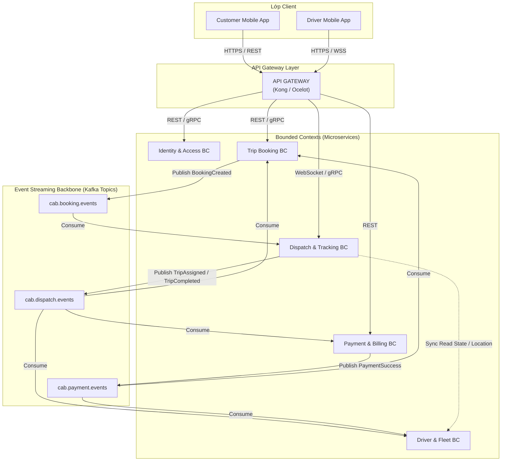
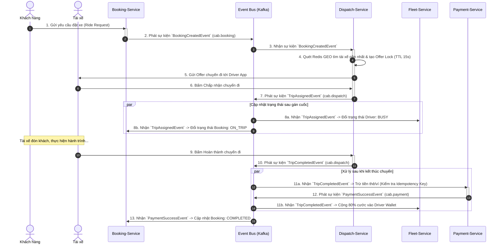

# CABSYSTEM - MICROSERVICE ARCHITECTURE DESIGN

## 1. Bản đồ Bounded Context & Chiến lược tích hợp (Context Mapping)



### Quy tắc tích hợp liên ngữ cảnh:
- **IAM BC → Các BC khác:** Upstream cung cấp Identity Context (JWT Claim chứa `user_id`, `role`).
- **Booking BC ↔ Dispatch BC:** Bất đồng bộ qua Kafka (`BookingCreatedEvent`, `TripAssignedEvent`).
- **Dispatch BC ↔ Fleet BC:** Dispatch truy vấn trực tiếp vị trí & trạng thái xe từ In-Memory Store.
- **Dispatch BC → Payment BC:** Kích hoạt giao dịch thanh toán khi nhận sự kiện `TripCompletedEvent`.

---

## 2. Ubiquitous Language theo từng Bounded Context

| Bounded Context | Thuật ngữ | Khái niệm kỹ thuật & nghiệp vụ tương ứng |
| :--- | :--- | :--- |
| **IAM** | **Subject Principal** | Định danh người dùng sau xác thực kèm bộ Claim phân quyền (Customer, Driver, Admin). |
| | **Credential Secret** | Mật khẩu băm (Argon2id/Bcrypt) hoặc Refresh Token dùng cho luồng gia hạn phiên. |
| **Booking** | **Fare Quote** | Bảng báo giá tạm tính (hiệu lực trong 5 phút) gồm giá gốc, hệ số Surge và giảm giá. |
| | **Waypoint** | Điểm dừng địa lý gồm tọa độ GPS (Vĩ độ/Kinh độ) và địa chỉ chuẩn hóa (Reverse-Geocoded). |
| | **Ride Booking** | Bản ghi yêu cầu chuyến xe do hành khách khởi tạo, quản lý trạng thái đơn hàng. |
| **Dispatch** | **Geo-Radius Batch** | Vùng không gian quét tài xế lân cận sử dụng thuật toán H3/Geohash hoặc Redis GEO. |
| | **Offer Dispatch** | Lượt gán chuyến có hạn giờ (15s TTL) dành riêng cho 1 tài xế được chọn. |
| | **Telemetry Trace** | Dữ liệu tọa độ, vận tốc, góc xoay la bàn liên tục từ GPS tài xế gửi lên qua WebSocket. |
| **Fleet** | **Shift Session** | Phiên hoạt động của tài xế (Bắt đầu Online → Kết thúc Offline). |
| | **Payout Wallet** | Tài khoản tiền ảo của tài xế dùng để đối soát doanh thu và rút tiền về ngân hàng. |
| **Payment** | **Idempotent Charge** | Giao dịch trừ tiền bảo đảm không duplicate dựa vào `idempotency_key` duy nhất. |
| | **Escrow Hold (Pre-auth)** | Giữ tiền/phong tỏa hạn mức thẻ trước khi xe đến, thực trừ khi cuốc kết thúc. |

---

## 3. Thiết kế Chi tiết 5 Microservices

### Service 1: Identity & Access Management Service (IAM)

- **Lựa chọn Cơ sở dữ liệu:** **PostgreSQL**
- **Lý do:** Cần tính toàn vẹn quan hệ (ACID), hỗ trợ Unique Index bảo đảm tính duy nhất của Username/Email, lưu trữ Token audit log ổn định, bảo mật cao.

#### Phân rã DDD (Domain-Driven Design)
- **Aggregate Root:** `UserAccount`
- **Entities:** `Role`, `UserSession`
- **Value Objects:** `EmailAddress`, `HashedPassword`, `PhoneNumber`, `AccountStatus` (`ACTIVE`, `LOCKED`, `INACTIVE`)

#### Mô hình CSDL (DDL SQL)
```sql
CREATE TYPE account_status AS ENUM ('ACTIVE', 'INACTIVE', 'LOCKED', 'SUSPENDED');

CREATE TABLE users (
    user_id UUID PRIMARY KEY DEFAULT gen_random_uuid(),
    username VARCHAR(50) UNIQUE NOT NULL,
    password_hash VARCHAR(255) NOT NULL,
    email VARCHAR(100) UNIQUE NOT NULL,
    phone_number VARCHAR(15) UNIQUE NOT NULL,
    status account_status NOT NULL DEFAULT 'ACTIVE',
    failed_login_count INT NOT NULL DEFAULT 0,
    locked_until TIMESTAMP WITH TIME ZONE NULL,
    created_at TIMESTAMP WITH TIME ZONE DEFAULT CURRENT_TIMESTAMP,
    updated_at TIMESTAMP WITH TIME ZONE DEFAULT CURRENT_TIMESTAMP
);

CREATE TABLE roles (
    role_id INT PRIMARY KEY,
    role_code VARCHAR(30) UNIQUE NOT NULL, -- 'ROLE_CUSTOMER', 'ROLE_DRIVER', 'ROLE_ADMIN'
    description VARCHAR(255)
);

CREATE TABLE user_roles (
    user_id UUID REFERENCES users(user_id) ON DELETE CASCADE,
    role_id INT REFERENCES roles(role_id) ON DELETE CASCADE,
    PRIMARY KEY (user_id, role_id)
);

CREATE TABLE auth_refresh_tokens (
    token_id UUID PRIMARY KEY DEFAULT gen_random_uuid(),
    user_id UUID NOT NULL REFERENCES users(user_id) ON DELETE CASCADE,
    token_hash VARCHAR(255) NOT NULL UNIQUE,
    device_fingerprint VARCHAR(150),
    is_revoked BOOLEAN NOT NULL DEFAULT FALSE,
    expires_at TIMESTAMP WITH TIME ZONE NOT NULL,
    created_at TIMESTAMP WITH TIME ZONE DEFAULT CURRENT_TIMESTAMP
);

CREATE INDEX idx_auth_tokens_user ON auth_refresh_tokens(user_id);
```

---

### Service 2: Trip & Booking Service

- **Lựa chọn Cơ sở dữ liệu:** **PostgreSQL**
- **Lý do:** Quy trình đặt cuốc mang tính giao dịch tài chính, phụ phí phức tạp, đòi hỏi khóa ngoại, ràng buộc trạng thái đơn hàng (BookingStatus State Machine) tránh sai sót dữ liệu.

#### Phân rã DDD
- **Aggregate Root:** `Booking`
- **Entities:** `PromotionCampaign`
- **Value Objects:** `LocationPoint` (Lat, Lng, Address), `FareSpecification` (Base, Surge, Tolls, Final), `BookingStatus`

#### Mô hình CSDL (DDL SQL)
```sql
CREATE TYPE service_type AS ENUM ('CAB_BIKE', 'CAB_CAR_4', 'CAB_CAR_7');
CREATE TYPE booking_status AS ENUM ('DRAFT', 'REQUESTED', 'ALLOCATED', 'ON_TRIP', 'COMPLETED', 'CANCELLED');

CREATE TABLE promotions (
    promo_code VARCHAR(30) PRIMARY KEY,
    description TEXT,
    discount_percentage NUMERIC(5,2) NOT NULL,
    max_discount_amount NUMERIC(10,2) NOT NULL,
    min_trip_amount NUMERIC(10,2) NOT NULL,
    start_time TIMESTAMP WITH TIME ZONE NOT NULL,
    end_time TIMESTAMP WITH TIME ZONE NOT NULL,
    usage_limit INT NOT NULL,
    used_count INT DEFAULT 0
);

CREATE TABLE bookings (
    booking_id UUID PRIMARY KEY DEFAULT gen_random_uuid(),
    customer_id UUID NOT NULL, -- Tham chiếu logic sang IAM Service
    driver_id UUID NULL,       -- Tham chiếu logic sang Fleet Service sau khi nhận
    service_type service_type NOT NULL,
    status booking_status NOT NULL DEFAULT 'REQUESTED',

    -- Pickup & Dropoff Value Objects
    pickup_latitude NUMERIC(9,6) NOT NULL,
    pickup_longitude NUMERIC(9,6) NOT NULL,
    pickup_address TEXT NOT NULL,
    dropoff_latitude NUMERIC(9,6) NOT NULL,
    dropoff_longitude NUMERIC(9,6) NOT NULL,
    dropoff_address TEXT NOT NULL,

    -- Fare Breakdown Value Object
    distance_meters INT NOT NULL,
    duration_seconds INT NOT NULL,
    base_fare NUMERIC(12,2) NOT NULL,
    surge_rate NUMERIC(4,2) DEFAULT 1.0,
    applied_promo_code VARCHAR(30) REFERENCES promotions(promo_code),
    discount_amount NUMERIC(12,2) DEFAULT 0.0,
    final_fare NUMERIC(12,2) NOT NULL,

    cancel_reason TEXT NULL,
    cancelled_by VARCHAR(20) NULL, -- 'CUSTOMER', 'DRIVER', 'SYSTEM_TIMEOUT'
    created_at TIMESTAMP WITH TIME ZONE DEFAULT CURRENT_TIMESTAMP,
    updated_at TIMESTAMP WITH TIME ZONE DEFAULT CURRENT_TIMESTAMP
);

CREATE INDEX idx_bookings_customer ON bookings(customer_id);
CREATE INDEX idx_bookings_status ON bookings(status);
```

---

### Service 3: Dispatch & Tracking Service

- **Lựa chọn Cơ sở dữ liệu:** **Redis (Cluster + In-Memory GEO) kết hợp MongoDB**
- **Lý do:**
  - **Redis GEO:** Quét tài xế lân cận với tọa độ di chuyển theo giây, hỗ trợ lệnh `GEOSEARCH` với độ trễ `< 2ms`; dùng Redis Key TTL (15 giây) để lock cuốc khi gửi offer cho tài xế.
  - **MongoDB (`trip_telemetry`):** Lưu trữ lượng lớn dữ liệu tọa độ GPS thực tế theo thời gian thực (Time-series / GeoJSON) mà không làm nghẽn RDBMS.

#### Phân rã DDD
- **Aggregate Root:** `DispatchTrip`
- **Entities:** `DriverGeoPulse`
- **Value Objects:** `Coordinates` (Lng, Lat), `BoundingBox`, `TripProgressStatus`

#### Cấu trúc Dữ liệu Bộ nhớ (Redis Storage Architecture)
1. **Quét tài xế khả dụng theo tọa độ:**
   - **Data Structure:** Redis Geospatial Sorted Set
   - **Key:** `active_drivers_geo:{service_type}`
   - **Cập nhật:** `GEOADD active_drivers_geo:CAB_CAR_4 106.7004 10.7769 "drv_uuid_101"`
   - **Quét tài xế gần điểm đón (bán kính 3km):**
     ```redis
     GEOSEARCH active_drivers_geo:CAB_CAR_4 FROMLONLAT 106.701 10.777 BYRADIUS 3 KM ASC COUNT 10
     ```

2. **Khóa chống gửi trùng cuốc (Mutual Exclusion Lock):**
   - **Key:** `dispatch:offer:{booking_id}`
   - **Value:** `{"driver_id": "drv_uuid_101", "expire_epoch": 1774353600}`
   - **TTL:** 15 giây (Acceptance Window).

#### Cấu trúc Document Lưu trữ Lộ trình GPS (MongoDB Schema)
```json
// Database: cab_dispatch_db | Collection: trip_routes
{
  "_id": "662657e8f1b4a621f8a81d4a",
  "trip_id": "9b1deb4d-3b7d-4bad-9bdd-2b0d7b3dcb6d",
  "driver_id": "a0011223-3b7d-4bad-9bdd-2b0d7b3dcb6d",
  "route_status": "COMPLETED",
  "start_time": "2026-09-23T10:00:00Z",
  "end_time": "2026-09-23T10:25:00Z",
  "actual_path": {
    "type": "LineString",
    "coordinates": [
      [106.70042, 10.77689],
      [106.70211, 10.77812],
      [106.70543, 10.78105]
    ]
  },
  "telemetry_samples": [
    {
      "timestamp": "2026-09-23T10:00:05Z",
      "lat": 10.77689,
      "lng": 106.70042,
      "speed_kmh": 32.5
    },
    {
      "timestamp": "2026-09-23T10:00:10Z",
      "lat": 10.77812,
      "lng": 106.70211,
      "speed_kmh": 41.0
    }
  ]
}
```

---

### Service 4: Driver & Vehicle Fleet Service

- **Lựa chọn Cơ sở dữ liệu:** **MongoDB**
- **Lý do:** Hồ sơ tài xế và giấy tờ đăng kiểm, bảo hiểm, thông số xe đa dạng (xe máy, xe 4 chỗ, 7 chỗ, xe điện); tài liệu ảnh chứng minh thư, bằng lái có cấu trúc động theo chính sách vận tải.

#### Phân rã DDD
- **Aggregate Root:** `DriverPartner`
- **Entities:** `VehicleUnit`, `DriverWallet`
- **Value Objects:** `DriverLicense`, `VehicleRegistration`, `DriverRatingSummary`

#### Cấu trúc Document MongoDB (`cab_fleet_db`)
```json
// Collection: drivers
{
  "_id": "c1234567-89ab-cdef-0123-456789abcdef",
  "user_id": "u0123456-89ab-cdef-0123-456789abcdef",
  "personal_info": {
    "full_name": "Phùng Võ Việt Tường Vi",
    "citizen_id": "079205001234",
    "phone": "0909123456"
  },
  "driver_license": {
    "license_number": "B2-791238491",
    "class": "B2",
    "expires_at": "2030-10-06T00:00:00Z",
    "verified": true
  },
  "vehicle": {
    "plate_number": "59A-999.88",
    "brand": "Toyota",
    "model": "Vios",
    "color": "Trắng",
    "seat_capacity": 4,
    "service_tier": "CAB_CAR_4",
    "inspection_expiry": "2027-05-15T00:00:00Z"
  },
  "operational_metrics": {
    "acceptance_rate": 96.5,
    "cancellation_rate": 1.2,
    "average_rating": 4.92,
    "total_trips": 1420
  },
  "wallet": {
    "current_balance": 1520000.00,
    "hold_balance": 0.00,
    "currency": "VND"
  },
  "system_status": "APPROVED",
  "shift_status": "ONLINE"
}
```

---

### Service 5: Payment & Billing Service

- **Lựa chọn Cơ sở dữ liệu:** **PostgreSQL**
- **Lý do:** Yêu cầu tuân thủ nguyên tắc ACID tuyệt đối. Không thể chấp nhận lỗi làm sai lệch số dư, double charge tiền của khách, bắt buộc có cơ chế Unique `idempotency_key` và Foreign Key chặt chẽ.

#### Phân rã DDD
- **Aggregate Root:** `PaymentTransaction`
- **Entities:** `PaymentMethod`, `InvoiceLedger`
- **Value Objects:** `MonetaryAmount` (Value, Currency), `TransactionStatus` (`PENDING`, `HOLD`, `SUCCESS`, `FAILED`, `REFUNDED`)

#### Mô hình CSDL (DDL SQL)
```sql
CREATE TYPE payment_method_type AS ENUM ('CASH', 'CREDIT_CARD', 'MOMO', 'ZALOPAY');
CREATE TYPE transaction_state AS ENUM ('INITIATED', 'PRE_AUTHORIZED', 'CAPTURED', 'FAILED', 'REFUNDED');

CREATE TABLE payment_methods (
    method_id UUID PRIMARY KEY DEFAULT gen_random_uuid(),
    user_id UUID NOT NULL, -- Tham chiếu logic sang IAM
    method_type payment_method_type NOT NULL,
    provider_token VARCHAR(255) NOT NULL, -- Token hóa qua cổng 3rd party (Stripe/MoMo), KHÔNG lưu thẻ gốc
    masked_pan VARCHAR(20) NOT NULL,       -- Vd: '**** **** **** 1234'
    is_default BOOLEAN NOT NULL DEFAULT FALSE,
    created_at TIMESTAMP WITH TIME ZONE DEFAULT CURRENT_TIMESTAMP
);

CREATE TABLE transactions (
    transaction_id UUID PRIMARY KEY DEFAULT gen_random_uuid(),
    booking_id UUID UNIQUE NOT NULL,      -- Quan hệ 1:1 với chuyến đi
    customer_id UUID NOT NULL,
    payment_method_id UUID REFERENCES payment_methods(method_id),

    idempotency_key VARCHAR(100) UNIQUE NOT NULL, -- Chống trùng thanh toán

    trip_fare NUMERIC(12,2) NOT NULL,
    toll_fee NUMERIC(12,2) DEFAULT 0.00,
    tip_amount NUMERIC(12,2) DEFAULT 0.00,
    total_charged NUMERIC(12,2) NOT NULL,
    currency VARCHAR(3) DEFAULT 'VND',

    state transaction_state NOT NULL DEFAULT 'INITIATED',
    gateway_transaction_no VARCHAR(100) NULL,
    failure_message TEXT NULL,
    created_at TIMESTAMP WITH TIME ZONE DEFAULT CURRENT_TIMESTAMP,
    settled_at TIMESTAMP WITH TIME ZONE NULL
);

CREATE INDEX idx_transactions_booking ON transactions(booking_id);
CREATE INDEX idx_transactions_idempotency ON transactions(idempotency_key);
```

---

## 4. Bảng Tổng hợp Công nghệ Cơ sở dữ liệu theo Bounded Context

| Bounded Context | Microservice | Công nghệ DB | Kiểu Database | Giải thích kỹ thuật cốt lõi |
| :--- | :--- | :--- | :--- | :--- |
| **Identity & Access** | `auth-service` | **PostgreSQL** | Relational RDBMS | Ràng buộc duy nhất (Unique) định danh, phân quyền RBAC quan hệ chặt chẽ, kiểm soát brute force và audit log. |
| **Trip & Booking** | `booking-service` | **PostgreSQL** | Relational RDBMS | Quản lý state machine cuốc xe, áp dụng mã voucher, tính toán cước đa thành phần theo quy tắc tài chính nghiêm ngặt. |
| **Dispatch & Tracking** | `dispatch-service` | **Redis Cluster + MongoDB** | In-Memory K/V + Document | Redis GEO xử lý tìm tài xế siêu tốc (<2ms); MongoDB Document lưu chuỗi tọa độ (LineString/GeoJSON) không tắc nghẽn. |
| **Driver & Fleet** | `fleet-service` | **MongoDB** | Document NoSQL | Thuộc tính xe và giấy phép lái xe linh động theo chủng loại; tài liệu xác thực có cấu trúc JSON lồng nhau tự nhiên. |
| **Payment & Billing** | `payment-service` | **PostgreSQL** | Relational RDBMS | Đảm bảo tính toán toàn vẹn tiền tệ (ACID), hỗ trợ `idempotency_key` Unique index chống trừ tiền kép, ghi log quyết toán. |

---

## 5. Quy trình Điều phối Giao dịch Phân tán (Saga Choreography Flow)

