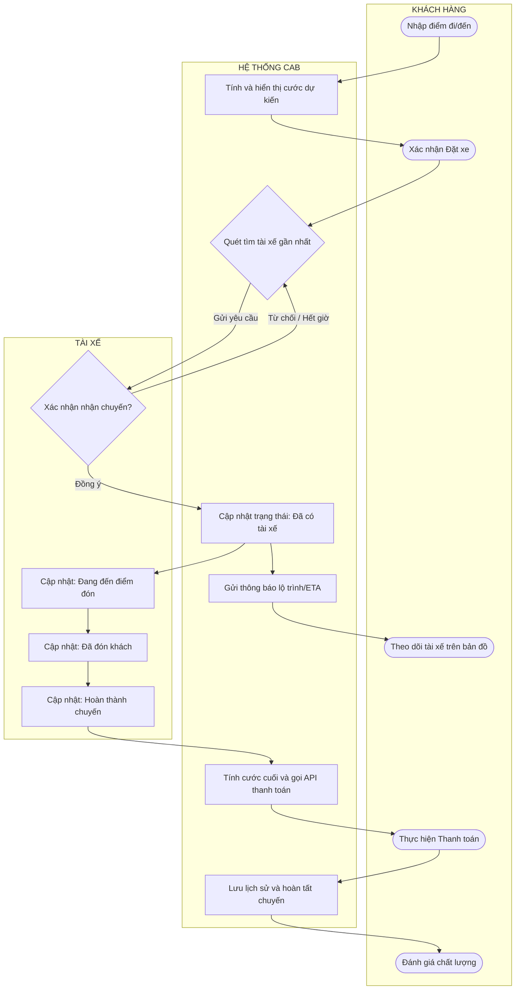
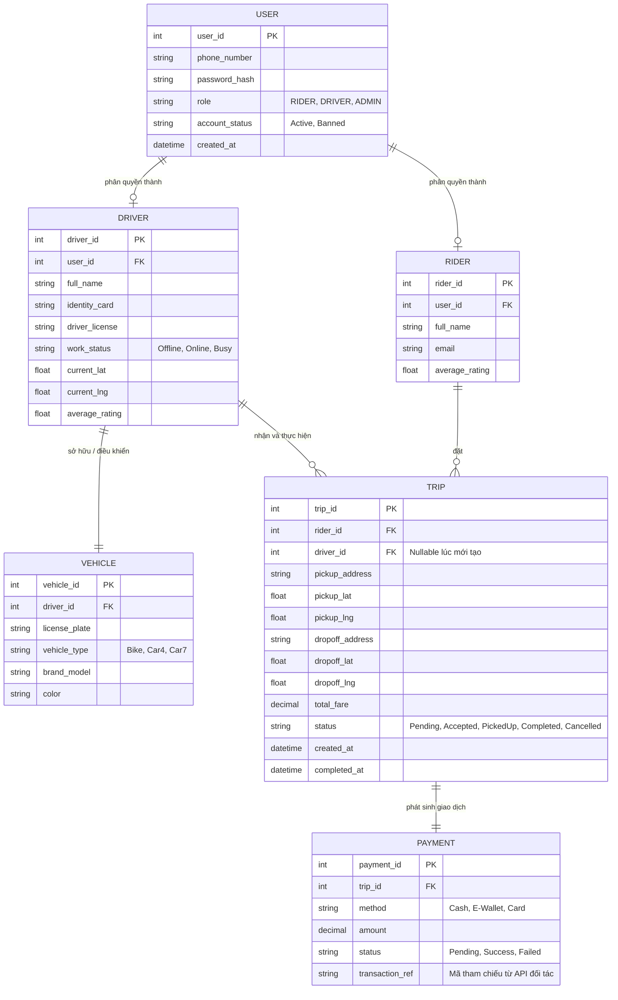
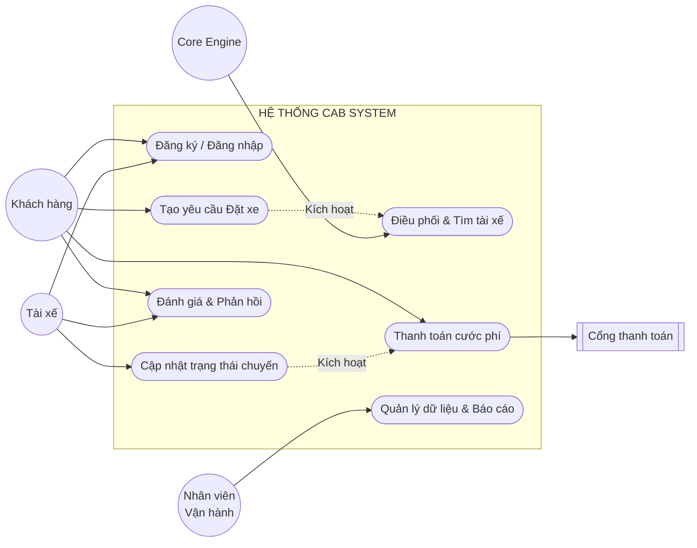

**Bước 1: đọc và phân tích yêu cầu: hiểuu về bussiness context và bussiness problem** 
### a) Khách hàng muốn giải quyết vấn đề gì?
Công ty ABC đang đối mặt với sự quá tải và kém hiệu quả trong khâu vận hành. Ban lãnh đạo muốn giải quyết 4 "nỗi đau" chính:
- Điểm nghẽn trong khâu phân công: Loại bỏ việc tổng đài viên phải phân công tài xế thủ công, chuyển sang điều phối tự động dựa trên thuật toán.
- Trải nghiệm khách hàng bị đứt gãy: Xóa bỏ tình trạng khách hàng "mù thông tin" sau khi đặt xe bằng cách cung cấp khả năng theo dõi vị trí và trạng thái chuyến đi theo thời gian thực.
- Rủi ro và thiếu đồng bộ trong thanh toán: Số hóa và tập trung hóa quy trình thanh toán thay vì quản lý phân tán, giảm thiểu rủi ro khi thu tiền mặt và tích hợp an toàn với đối tác bên thứ ba.
- Nút thắt trong kiến trúc công nghệ: Đập bỏ nền tảng cũ thiếu linh hoạt để xây dựng kiến trúc mới giúp hệ thống không bị sập toàn bộ khi một tính năng (như thông báo hay thanh toán) gặp lỗi.
  
### b) Vì sao k thể đáp ứng, ai sử dụng hệ thống này
- Hệ thống hiện tại (gồm tổng đài và app đơn giản) đã chạm đến "giới hạn trần" của sự phát triển do:
  + Năng lực xử lý thấp: Dùng sức người để phân công tài xế chỉ hiệu quả với quy mô nhỏ. Khi số lượng cuốc xe tăng vọt vào giờ cao điểm, tổng đài sẽ quá tải, dẫn đến mất khách.
  + Thiếu khả năng tương tác dữ liệu hai chiều: Ứng dụng hiện tại giống một kênh ghi nhận yêu cầu một chiều. Nó không thu thập được vị trí GPS liên tục của tài xế để tính toán ETA (thời gian dự kiến đến) hay tối ưu hóa thuật toán tìm tài xế gần nhất.
  + Kiến trúc nguyên khối cứng nhắc: Việc mở rộng bị kìm hãm. Bộ phận vận hành không thể dễ dàng thêm phương thức thanh toán mới hay kênh thông báo mới vì can thiệp vào code cũ có nguy cơ làm hỏng các tính năng đang chạy ổn định.
- Hệ thống phục vụ một mô hình kinh doanh kết nối đa chiều, với 3 nhóm người dùng chính:
  + Khách hàng: Người có nhu cầu di chuyển, cần sự tiện lợi, minh bạch về giá cả và lộ trình.
  + Tài xế: Người cung cấp dịch vụ vận tải, cần hệ thống nhận chuyến ổn định, tính toán cước phí chính xác và thu nhập rõ ràng.
  + Nhân viên vận hành & Ban giám đốc: Người kiểm soát hệ thống, hỗ trợ giải quyết sự cố (lỗi chuyến, thanh toán thất bại), quản lý rủi ro và sử dụng các báo cáo dữ liệu (doanh thu, tỷ lệ hủy) để ra quyết định chiến lược.
    
### c)  Giá trị sau khi tạo ra
Việc triển khai thành công CAB System mới sẽ mang lại những giá trị cốt lõi:
- Hiệu quả vận hành: Tự động hóa hoàn toàn quy trình "Matching" (ghép cuốc), tiết kiệm chi phí nhân sự tổng đài và tối ưu hóa thời gian chạy xe trống của tài xế.
- Nâng tầm trải nghiệm người dùng: Trải nghiệm mượt mà từ lúc đặt xe, theo dõi lộ trình đến thanh toán không tiền mặt sẽ làm tăng tỷ lệ giữ chân khách hàng.
- Nền tảng của sự tăng trưởng: Doanh nghiệp sở hữu một hệ thống lõi vững chắc, dễ dàng triển khai thêm các mô hình kinh doanh mới trong tương lai (như giao hàng, đi chung xe, đa dạng cổng thanh toán) mà không phải đập đi xây lại.
- Quản trị dựa trên dữ liệu: Mọi điểm chạm đều được số hóa, giúp ban lãnh đạo có các dashboard báo cáo trực quan về hiệu suất thực tế của mô hình kinh doanh.
  
**Bước 2: xác định stakeholder, lập bảng cột 1 những stakeholder, cột 2 vai trò, vẽ ma trận stakeholder cho biết mức độ ảnh hưởng của các vai trò trong hệ thống**

| Stakeholder | Vai trò |
| :--- | :--- |
| **Ban giám đốc** | Đưa ra tầm nhìn chiến lược, quyết định phạm vi yêu cầu, phê duyệt ngân sách và nghiệm thu dự án. |
| **Khách hàng** | Người dùng cuối sử dụng ứng dụng để đăng ký, đặt xe, theo dõi lộ trình, thanh toán và đánh giá dịch vụ. |
| **Tài xế** | Đối tác trực tiếp thực hiện chuyến đi, sử dụng hệ thống để nhận cuốc, định vị GPS và cập nhật trạng thái hành trình. |
| **Nhân viên vận hành** | Quản trị viên của hệ thống, thực hiện quản lý tài khoản, hỗ trợ xử lý sự cố chuyến đi/thanh toán và theo dõi báo cáo hoạt động. |
| **Đối tác bên thứ 3** | Cung cấp các dịch vụ hạ tầng tích hợp bên ngoài như nền tảng bản đồ (Maps), cổng thanh toán điện tử và dịch vụ gửi thông báo. |
| **Đội ngũ phát triển** | Thu thập yêu cầu, phân tích, thiết kế, lập trình và kiểm thử hệ thống để đảm bảo tiến độ 7 tuần. |

### Ma trận Stakeholder (Power - Interest Matrix)

| | Quan tâm THẤP (Low Interest) | Quan tâm CAO (High Interest) |
| :--- | :--- | :--- |
| **Quyền lực CAO**  | **GIỮ HÀI LÒNG**    • Đối tác bên thứ 3 (Thanh toán, SMS, Maps) | **QUẢN LÝ CHẶT CHẼ**    • Ban giám đốc   • Đội ngũ phát triển dự án |
| **Quyền lực THẤP**  | **THEO DÕI**    | **THƯỜNG XUYÊN THÔNG TIN**    • Khách hàng  • Tài xế   • Nhân viên vận hành |

**Bước 3: Business Goals**

Dự án xây dựng nền tảng CAB System hướng tới việc giải quyết các hạn chế của hệ thống cũ và đạt được các mục tiêu kinh doanh cốt lõi sau:

**1. Mục tiêu Vận hành & Hiệu suất (Operational Goals)**
* **Tự động hóa hoàn toàn luồng điều phối:** Loại bỏ quy trình phân công tài xế thủ công, sử dụng thuật toán ghép cuốc (matching) tự động dựa trên vị trí và trạng thái để phục vụ số lượng lớn khách hàng cùng lúc.
* **Quản trị tập trung và ra quyết định dựa trên dữ liệu:** Cung cấp công cụ quản lý toàn diện cho nhân viên vận hành và hệ thống báo cáo (doanh thu, tỷ lệ hoàn thành/hủy chuyến, hiệu suất tài xế) cho Ban lãnh đạo.

**2. Mục tiêu Trải nghiệm Người dùng (Experience Goals)**
* **Đối với Khách hàng:** Nâng cao sự hài lòng thông qua trải nghiệm liền mạch: minh bạch giá cước, theo dõi vị trí xe theo thời gian thực (real-time tracking) và thanh toán đa phương thức an toàn.
* **Đối với Tài xế:** Tối ưu hóa thời gian chờ và chạy xe trống nhờ hệ thống nhận chuyến thông minh, nhanh chóng, giúp nâng cao năng suất và thu nhập.

**3. Mục tiêu Chiến lược & Công nghệ (Strategic & Technical Goals)**
* **Khả năng mở rộng dài hạn (Scalability & Flexibility):** Xây dựng kiến trúc hệ thống linh hoạt, các module hoạt động độc lập (đặt xe, thanh toán, thông báo). Cho phép dễ dàng mở rộng, bổ sung dịch vụ mới hoặc đối tác mới trong tương lai mà không cần xây dựng lại toàn bộ ứng dụng.
* **Đảm bảo tính ổn định cao (High Availability):** Hệ thống chịu tải tốt trong các khung giờ cao điểm; lỗi cục bộ ở một chức năng không làm gián đoạn toàn bộ hoạt động đặt xe.
* **Đáp ứng Time-to-market:** Triển khai thành công nền tảng với các tính năng cốt lõi (MVP) đúng thời hạn cam kết là **7 tuần**.

**Bước 4: Xác định phạm vi (Scope)**
### Phạm vi dự án (Project Scope)

Với thời gian triển khai giới hạn trong **7 tuần**, dự án sẽ tập trung vào việc xây dựng Nền tảng cốt lõi (Core Platform) đảm bảo luồng đặt xe tự động hóa khép kín.

#### 1. Trong phạm vi dự án 

**1.1. Ứng dụng dành cho Khách hàng**
*   **Quản lý tài khoản:** Đăng ký, đăng nhập (xác thực), quản lý thông tin cá nhân.
*   **Chức năng Đặt xe:** Nhập điểm đón/đến, chọn loại dịch vụ (loại xe), xem cước phí dự kiến và tạo yêu cầu.
*   **Theo dõi & Tương tác:** Theo dõi trạng thái chuyến đi theo thời gian thực (đang tìm tài xế, tài xế đã nhận, thời gian dự kiến đến - ETA, đang di chuyển).
*   **Thanh toán & Hậu mãi:** Hỗ trợ thanh toán tiền mặt và tích hợp API thanh toán điện tử; xem lịch sử chuyến đi; đánh giá tài xế.

**1.2. Ứng dụng dành cho Tài xế**
*   **Quản lý trạng thái:** Đăng nhập, cập nhật hồ sơ/phương tiện, bật/tắt trạng thái "Sẵn sàng nhận chuyến".
*   **Xử lý chuyến đi:** Nhận thông báo cuốc xe mới, Chấp nhận/Từ chối chuyến.
*   **Cập nhật hành trình:** Thao tác cập nhật các mốc thời gian: Đã đến điểm đón -> Đã đón khách -> Đang di chuyển -> Hoàn thành.
*   **Định vị:** Gửi vị trí GPS liên tục về hệ thống để phục vụ điều phối.

**1.3. Cổng quản trị vận hành**
*   **Quản lý danh mục:** Quản lý thông tin Khách hàng, Tài xế và Phương tiện (hỗ trợ tạo tài khoản cho tài xế).
*   **Giám sát thời gian thực:** Theo dõi các chuyến đi đang diễn ra và vị trí tài xế.
*   **Hỗ trợ nghiệp vụ:** Xử lý các chuyến đi bị lỗi, tra cứu lịch sử giao dịch.
*   **Báo cáo & Phân quyền:** Phân quyền truy cập; Cung cấp báo cáo cơ bản (tổng chuyến, doanh thu, tỷ lệ hủy, hiệu suất tài xế).

**1.4. Hệ thống cốt lõi**
*   **Thuật toán điều phối:** Tự động tìm và đề xuất tài xế gần nhất/phù hợp nhất. Có cơ chế vòng lặp (chuyển tài xế khác nếu bị từ chối/timeout).
*   **Hệ thống thông báo:** Bắn thông báo theo các sự kiện của chuyến đi.
*   **Tính cước & Giao dịch:** Tự động tính tiền dựa trên loại xe/khoảng cách; xử lý logic khi giao dịch thanh toán thất bại.
*   **Bảo mật:** Lưu vết (Audit log) các thao tác quan trọng.

---

#### 2. Ngoài phạm vi dự án

Đây là các tính năng/yêu cầu **KHÔNG** được phát triển trong giai đoạn 7 tuần này, nhưng kiến trúc hệ thống vẫn phải được thiết kế để sẵn sàng tích hợp sau này:
*   **Lưu trữ dữ liệu thanh toán nhạy cảm:** Hệ thống KHÔNG lưu trữ thông tin thẻ tín dụng/tài khoản ngân hàng của khách hàng (giao phó hoàn toàn cho cổng thanh toán bên thứ 3).
*   **Mô hình dịch vụ mới:** Chưa phát triển các nghiệp vụ ghép chuyến, giao hàng hay thuê xe theo giờ.
*   **Đa dạng hóa nhà cung cấp:** Trong 7 tuần chỉ tích hợp 1 đối tác thanh toán và 1 kênh thông báo chính. Việc thêm nhiều nhà cung cấp khác được dời sang các giai đoạn sau.
*   **Quy trình thủ công cũ:** Loại bỏ hoàn toàn tính năng tổng đài viên tự tay phân công tài xế như hệ thống cũ.
  
**Bước 5: Business Requirement**

### 1. Yêu cầu Chức năng cấp cao (High-level Functional Requirements)
Hệ thống được chia thành 4 phân hệ (Modules) chính để đáp ứng luồng nghiệp vụ:

*   **Phân hệ Khách hàng (Rider Module):** Quản lý hồ sơ, chọn điểm đi/đến (sử dụng bản đồ), hiển thị giá cước dự kiến, gửi yêu cầu đặt chuyến, theo dõi tài xế (thời gian thực), thanh toán và đánh giá.
*   **Phân hệ Tài xế (Driver Module):** Bật/tắt trạng thái hoạt động, nhận thông báo cuốc xe mới, chấp nhận/từ chối, cập nhật trạng thái chuyến đi (Đã đến điểm đón -> Đã đón khách -> Hoàn thành), theo dõi thu nhập.
*   **Phân hệ Điều phối cốt lõi (Core Dispatch & Engine):** Thuật toán tìm kiếm tài xế gần nhất, quản lý vòng lặp (fallback) khi tài xế từ chối, tính toán cước phí tự động, gửi thông báo đa kênh.
*   **Phân hệ Quản trị (Admin Module):** Giao diện quản lý toàn bộ User (Khách hàng/Tài xế), quản lý xe, giám sát chuyến đi đang diễn ra (Real-time monitoring), xử lý khiếu nại/lỗi chuyến và hệ thống báo cáo (Dashboard).

---

### 2. Danh sách Quy tắc Nghiệp vụ (Business Rules)
Đây là các quy tắc logic cốt lõi mà hệ thống phải tuân thủ nghiêm ngặt trong quá trình vận hành.

| Mã BR | Tên quy tắc | Mô tả chi tiết |
| :--- | :--- | :--- |
| **BR-01** | **Điều kiện nhận chuyến** | Tài xế chỉ nhận được yêu cầu đặt xe khi trạng thái tài khoản là "Active" và trạng thái làm việc đang bật "Sẵn sàng". |
| **BR-02** | **Logic Điều phối (Matching)** | Hệ thống ưu tiên phát cuốc cho tài xế có vị trí địa lý gần điểm đón nhất. Nếu sau `[X]` giây (Cần chốt với Khách hàng) tài xế không phản hồi hoặc bấm từ chối, hệ thống tự động phát cuốc cho tài xế gần thứ 2. |
| **BR-03** | **Xử lý Không tìm thấy tài xế** | Nếu sau khi quét toàn bộ bán kính quy định mà không có tài xế nhận chuyến, hệ thống phải tự động hủy yêu cầu và gửi thông báo xin lỗi khách hàng. Khách hàng không phải thao tác tạo lại từ đầu nếu muốn thử lại. |
| **BR-04** | **Bảo mật dữ liệu thanh toán** | Hệ thống CAB **tuyệt đối không** lưu trữ thông tin thẻ tín dụng/CVV/Tài khoản ngân hàng của khách. Mọi dữ liệu thanh toán nhạy cảm phải được xử lý qua token của Cổng thanh toán (Payment Gateway). |
| **BR-05** | **Xử lý thanh toán thất bại** | Nếu giao dịch điện tử lỗi, hệ thống phải thông báo ngay cho khách hàng và cung cấp nút "Thanh toán lại" hoặc cho phép chuyển đổi sang hình thức "Tiền mặt". Chuyến đi vẫn được tính là hoàn thành. |

---

### 3. Yêu cầu Phi chức năng (Non-Functional Requirements - NFR)

| Nhóm yêu cầu | Mã NFR | Mô tả yêu cầu |
| :--- | :--- | :--- |
| **Kiến trúc & Khả năng mở rộng** | NFR-01 | Xây dựng kiến trúc module linh hoạt (Microservices/Modular Monolith) để các thành phần: Đặt xe, Thanh toán, Thông báo hoạt động độc lập. |
| | NFR-02 | Hệ thống phải có khả năng mở rộng (Scale-out) từng phần (ví dụ: chỉ tăng tài nguyên cho server thanh toán) mà không ảnh hưởng toàn hệ thống. |
| **Độ sẵn sàng (Availability)** | NFR-03 | Hệ thống không được sập toàn bộ khi một bên thứ 3 (như API Gửi tin nhắn) gặp sự cố. Phải có cơ chế xử lý lỗi cục bộ. |
| **Bảo mật & Kiểm toán** | NFR-04 | Mọi thao tác quản trị từ Admin, thay đổi số dư, hủy chuyến đều phải được hệ thống lưu vết (Audit Log) để phục vụ tra soát. |
| | NFR-05 | 100% người dùng (Khách hàng & Tài xế) phải được xác thực (Authentication) trước khi sử dụng các tính năng đặt chuyến/nhận chuyến. |

---

### 4. Ràng buộc và Phụ thuộc 
*   **Thời gian:** Dự án phải hoàn thành xây dựng và triển khai phiên bản đầu tiên (MVP) khép kín luồng đặt xe trong đúng **7 tuần**. Không gia hạn.
*   **Phụ thuộc bên thứ 3:** Tính năng định vị phụ thuộc vào độ chính xác của Map API (vd: Google Maps/Mapbox). Tính năng thanh toán phụ thuộc vào uptime của Đối tác thanh toán.

**Bước 6: Business Process**
### Sơ đồ Quy trình Nghiệp vụ (Business Process Flow)

**Bước 7: Phân rã yêu cầu chức năng**
## PHÂN RÃ YÊU CẦU CHỨC NĂNG (Functional Decomposition)

Hệ thống CAB System được phân rã thành 4 phân hệ chính: Khách hàng, Tài xế, Quản trị viên và Lõi hệ thống 

| Phân hệ (Module) | Nhóm chức năng (Feature) | Mã UC | Chức năng chi tiết (Sub-function) | Ưu tiên |
| :--- | :--- | :--- | :--- | :---: |
| **1. ỨNG DỤNG KHÁCH HÀNG** | **1.1. Quản lý tài khoản** | F-RID-01 | Đăng ký & Đăng nhập (SĐT / Email) | Cao |
| | | F-RID-02 | Cập nhật thông tin cá nhân (Tên, Hình ảnh) | Trung bình |
| | **1.2. Đặt chuyến** | F-RID-03 | Nhập/Chọn điểm đón và điểm đến trên bản đồ | Cao |
| | | F-RID-04 | Lựa chọn loại dịch vụ (Xe máy, Ô tô 4 chỗ, 7 chỗ) | Cao |
| | | F-RID-05 | Hiển thị cước phí dự kiến và xác nhận đặt xe | Cao |
| | **1.3. Theo dõi hành trình** | F-RID-06 | Xem trạng thái tìm kiếm và thông tin tài xế nhận cuốc | Cao |
| | | F-RID-07 | Theo dõi vị trí tài xế theo thời gian thực (Real-time GPS) | Cao |
| | | F-RID-08 | Hủy yêu cầu đặt xe (khi chưa có tài xế hoặc tài xế chưa đến) | Cao |
| | **1.4. Thanh toán & Hậu mãi** | F-RID-09 | Lựa chọn phương thức thanh toán (Tiền mặt / Điện tử) | Cao |
| | | F-RID-10 | Chấm điểm (Rating) và nhận xét tài xế sau chuyến đi | Trung bình |
| | | F-RID-11 | Xem lịch sử chuyến đi và chi tiết thanh toán | Thấp |
| | | | | |
| **2. ỨNG DỤNG TÀI XẾ** | **2.1. Quản lý tài khoản & Xe** | F-DRI-01 | Đăng nhập tài khoản (do Admin cấp hoặc tự đăng ký) | Cao |
| | | F-DRI-02 | Cập nhật thông tin phương tiện (Biển số, Loại xe) | Trung bình |
| | **2.2. Trạng thái hoạt động** | F-DRI-03 | Bật / Tắt trạng thái "Sẵn sàng nhận chuyến" (Online/Offline) | Cao |
| | **2.3. Xử lý chuyến đi** | F-DRI-04 | Nhận thông báo yêu cầu cuốc xe mới (Hiển thị điểm đón/đến) | Cao |
| | | F-DRI-05 | Chấp nhận hoặc Từ chối yêu cầu chuyến đi | Cao |
| | **2.4. Cập nhật hành trình** | F-DRI-06 | Cập nhật trạng thái: "Đã đến điểm đón" | Cao |
| | | F-DRI-07 | Cập nhật trạng thái: "Đã đón khách" (Bắt đầu di chuyển) | Cao |
| | | F-DRI-08 | Cập nhật trạng thái: "Hoàn thành chuyến" | Cao |
| | | | | |
| **3. CỔNG QUẢN TRỊ** | **3.1. Quản lý người dùng** | F-ADM-01 | Quản lý danh sách Khách hàng (Xem, Khóa tài khoản) | Trung bình |
| | | F-ADM-02 | Quản lý danh sách Tài xế & Phương tiện (Duyệt hồ sơ mới) | Cao |
| | **3.2. Giám sát & Hỗ trợ** | F-ADM-03 | Xem bản đồ trực tuyến các chuyến đi đang diễn ra | Trung bình |
| | | F-ADM-04 | Hỗ trợ hủy chuyến khẩn cấp hoặc xử lý lỗi cuốc xe | Cao |
| | | F-ADM-05 | Phân quyền nhân viên quản trị (Role-Based Access) | Trung bình |
| | **3.3. Báo cáo thống kê** | F-ADM-06 | Xem báo cáo tổng chuyến đi, tỷ lệ hoàn thành/hủy chuyến | Trung bình |
| | | F-ADM-07 | Xem báo cáo doanh thu theo ngày/tuần/tháng | Trung bình |
| | | | | |
| **4. LÕI HỆ THỐNG (Core Engine)** | **4.1. Thuật toán Điều phối** | F-COR-01 | Quét & Đề xuất tài xế phù hợp gần nhất dựa trên GPS | Cao |
| | | F-COR-02 | Tự động chuyển cuốc (Fallback) nếu tài xế từ chối/hết giờ | Cao |
| | **4.2. Xử lý logic** | F-COR-03 | Thuật toán tính cước phí (Dựa trên khoảng cách + Loại xe) | Cao |
| | | F-COR-04 | Tích hợp cổng thanh toán bên thứ 3 (Payment Gateway API) | Cao |
| | | F-COR-05 | Hệ thống gửi thông báo đa kênh (Push Notification / SMS) | Cao |

**Bước 8: Business Rules and Exception**
## 5. QUY TẮC NGHIỆP VỤ & TRƯỜNG HỢP NGOẠI LỆ

### 5.1. Quy tắc nghiệp vụ (Business Rules)
Đây là các quy tắc logic hệ thống bắt buộc tuân thủ. Các thông số [Nằm trong ngoặc vuông] là các tham số có thể cấu hình (Configurable) trên hệ thống quản trị.

| Mã BR | Nhóm | Mô tả Quy tắc (Business Rule Description) |
| :--- | :--- | :--- |
| **BR-01** | **Trạng thái Tài xế** | Tài xế chỉ nhận được yêu cầu điều phối chuyến đi mới khi và chỉ khi: (1) Tài khoản đang "Hoạt động", (2) App đang bật "Sẵn sàng nhận chuyến", và (3) Không đang thực hiện cuốc xe nào khác. |
| **BR-02** | **Logic Điều phối (Matching)** | Thuật toán ưu tiên: Ưu tiên 1 là khoảng cách (Bán kính `[3km]` tính từ điểm đón), Ưu tiên 2 là Tài xế có thời gian chờ lâu nhất. |
| **BR-03** | **Thời gian chờ (Timeout)** | Tài xế có tối đa `[15 giây]` để Chấp nhận hoặc Từ chối chuyến. Quá thời gian này, hệ thống tự động tính là "Bỏ qua" và chuyển cuốc cho tài xế phù hợp tiếp theo. |
| **BR-04** | **Tính cước phí** | Cước phí chuyến đi = Giá mở cửa + (Khoảng cách GPS dự kiến x Giá mỗi km). Cước phí hiển thị lúc đặt xe là **giá cố định (Fixed Price)**, không thay đổi trừ khi khách hàng đổi điểm đến. |
| **BR-05** | **Chính sách Thanh toán** | CAB System tuyệt đối không lưu trữ thông tin số thẻ tín dụng/CVV của khách hàng. Việc mã hóa (Tokenization) và trừ tiền do Cổng thanh toán (Payment Gateway) thực hiện. |
| **BR-06** | **Chính sách Hủy chuyến** | Khách hàng được hủy chuyến **Miễn phí** nếu tài xế chưa đến điểm đón. Nếu tài xế đã xác nhận "Đã đến điểm đón" mà khách hủy, hệ thống ghi nhận `[1 lần vi phạm]`. Nếu vi phạm `[3 lần/ngày]`, khóa tính năng đặt xe `[24 giờ]`. |

---

### 5.2. Các trường hợp ngoại lệ (Exceptions & Handling)
Các kịch bản ngoài "Happy Path" và cách hệ thống tự động xử lý (Fallback Mechanism) để không làm gián đoạn trải nghiệm người dùng.

| Mã EX | Tình huống ngoại lệ (Exception Scenario) | Hướng xử lý của Hệ thống (System Action / Fallback) |
| :--- | :--- | :--- |
| **EX-01** | **Không tìm thấy tài xế**   *(Quét hết bán kính nhưng không có tài xế nào nhận hoặc online)* | Gửi thông báo Push Notification: "Hiện tại các tài xế đều đang bận. Vui lòng thử lại sau ít phút". Nút thao tác nhanh: [Thử lại ngay]. Không yêu cầu nhập lại điểm đi/đến. |
| **EX-02** | **Thanh toán điện tử thất bại**   *(Lỗi từ ví điện tử/ngân hàng, không đủ số dư, timeout)* | 1. Hệ thống báo lỗi thanh toán trên app Khách hàng.  2. Chuyển trạng thái chuyến đi sang "Thanh toán bằng Tiền mặt" để khách trả cho tài xế, HOẶC cho phép "Ghi nợ" vào tài khoản khách hàng để trừ vào chuyến sau. |
| **EX-03** | **Mất kết nối mạng (Tài xế)**   *(Tài xế rớt mạng 3G/4G khi đang chở khách)* | Hệ thống lưu trữ trạng thái chuyến đi hiện tại trên Server. Khi tài xế có mạng lại, App tự động đồng bộ (Sync) dữ liệu về cuốc xe đang chạy. Cuốc xe tính theo định tuyến map ban đầu, không dựa vào định vị ngắt quãng. |
| **EX-04** | **Tài xế cố tình không đón khách**   *(Tài xế đã nhận chuyến nhưng xe đứng yên quá `[10 phút]`)* | Hệ thống tự động bật cảnh báo (Popup) hỏi Khách hàng: "Tài xế có vẻ đang kẹt. Bạn có muốn tìm tài xế khác không?". Nếu Khách đồng ý, tự động Hủy chuyến (Không phạt khách) và tìm tài xế mới. |
| **EX-05** | **Khách hàng không xuất hiện (No-show)**   *(Tài xế đến nơi, chờ quá `[5 phút]` nhưng không liên lạc được)* | Cấp quyền cho Tài xế bấm nút "Hủy chuyến do Khách vắng mặt" mà không bị ảnh hưởng tỷ lệ hoàn thành cuốc. Khách hàng bị ghi nhận 1 lần vi phạm (No-show). |

**Bước 9: Data Modeling**
### 6.1. Sơ đồ Thực thể - Liên kết (ERD - Entity Relationship Diagram)

---

### 6.2. Từ điển Dữ liệu (Data Dictionary - Các thực thể cốt lõi)

**1. Bảng `TRIP` (Lưu trữ thông tin cuốc xe - Bảng quan trọng nhất)**
Bảng này xử lý toàn bộ vòng đời của một chuyến đi. Việc thiết kế lưu tọa độ (Lat/Lng) tách biệt với địa chỉ (Address) giúp hệ thống dễ dàng tính toán khoảng cách và kết nối với Map API.
*   **trip_id** (PK): Mã chuyến đi duy nhất.
*   **rider_id** (FK): ID của khách hàng đặt xe.
*   **driver_id** (FK): ID của tài xế nhận chuyến (Cho phép `NULL` lúc khách vừa ấn đặt xe và đang chờ hệ thống tìm tài xế).
*   **pickup_lat / pickup_lng**: Tọa độ điểm đón.
*   **dropoff_lat / dropoff_lng**: Tọa độ điểm đến.
*   **total_fare**: Giá cước cuốc xe (Fix cứng khi khách bấm đặt).
*   **status**: Trạng thái chuyến đi (`Pending` -> `Accepted` -> `Arrived` -> `PickedUp` -> `InTransit` -> `Completed` / `Cancelled`).

**2. Bảng `DRIVER` (Lưu trữ thông tin & Trạng thái tài xế)**
Thiết kế tập trung vào việc phục vụ **Thuật toán điều phối (Matching Engine)** với hiệu suất cao.
*   **work_status**: Trạng thái làm việc (`Online` - sẵn sàng nhận cuốc, `Busy` - đang chở khách không nhận thêm cuốc, `Offline` - tắt app). Thuật toán chỉ quét các tài xế có status là `Online`.
*   **current_lat / current_lng**: Tọa độ GPS hiện tại của tài xế. (Lưu ý: Trong hệ thống thực tế, tọa độ này sẽ được cập nhật liên tục qua Redis/Websocket để tracking realtime thay vì ghi liên tục vào Database SQL để tránh sập hệ thống).

**3. Bảng `PAYMENT` (Lưu trữ Giao dịch Thanh toán)**
Tuân thủ chuẩn bảo mật PCI-DSS theo yêu cầu của doanh nghiệp (Không lưu thông tin nhạy cảm).
*   **method**: Phương thức thanh toán (Tiền mặt, Thẻ, Ví điện tử).
*   **transaction_ref**: Mã giao dịch (Token/Ref ID) trả về từ Cổng thanh toán bên thứ 3. Nếu có lỗi xảy ra, Nhân viên vận hành sẽ dùng mã này để đối soát (Cross-check) với đối tác.
*   **status**: `Pending` (Đang chờ), `Success` (Thành công), `Failed` (Thất bại).

**4. Bảng `VEHICLE` (Lưu trữ thông tin Xe)**
*   Được tách ra khỏi bảng `DRIVER` để linh hoạt. Trong tương lai (Phase 2), nếu 1 tài xế có thể đăng ký nhiều xe hoặc đổi xe, ta chỉ cần thay đổi khóa phụ (FK) mà không bị kẹt kiến trúc.

**Bước 10: Non-Functional Requirement**

Yêu cầu phi chức năng xác định các tiêu chí chất lượng (Quality Attributes) để đánh giá hoạt động của hệ thống, thay vì các hành vi cụ thể. Đối với CAB System, các NFRs này là kim chỉ nam cho thiết kế Kiến trúc phần mềm (System Architecture).

### Bảng Chi tiết Yêu cầu Phi chức năng

| Nhóm NFR | Mã NFR | Mô tả tiêu chí chất lượng (Quality Criteria) |
| :--- | :--- | :--- |
| **1. Khả năng mở rộng & Hiệu năng (Scalability & Performance)** | **NFR-PER-01** | **Thời gian phản hồi (Response Time):** Các thao tác quan trọng như "Lấy giá cước", "Tìm tài xế" phải phản hồi dưới `2 giây` ở điều kiện mạng bình thường (4G/Wifi). |
| | **NFR-PER-02** | **Xử lý đồng thời (Concurrency):** Hệ thống core phải xử lý mượt mà tối thiểu `[1000]` cuốc xe được đặt cùng một thời điểm trong giờ cao điểm mà không bị nghẽn cổ chai (bottleneck). |
| | **NFR-PER-03** | **Kiến trúc phân tán (Decoupling):** Các module Đặt xe, Thanh toán, và Thông báo phải được thiết kế độc lập. Cho phép tăng tài nguyên (Scale-up/Scale-out) riêng biệt cho từng service khi tải tăng. |
| **2. Tính sẵn sàng & Chịu lỗi (Availability & Fault Tolerance)** | **NFR-AVA-01** | **Thời gian hoạt động (Uptime):** Hệ thống phải đảm bảo hoạt động liên tục với cam kết Uptime đạt `99.9%` (Khoảng 43 phút downtime tối đa mỗi tháng). |
| | **NFR-AVA-02** | **Cô lập lỗi (Fault Isolation):** Lỗi ở các dịch vụ ngoại vi (Ví dụ: Đối tác thanh toán sập, lỗi API gửi SMS) **tuyệt đối không** được làm sập chức năng Đặt xe (Core Booking). Hệ thống phải có cơ chế bỏ qua (Bypass) hoặc dùng giải pháp thay thế. |
| **3. Bảo mật & Kiểm toán (Security & Audit)** | **NFR-SEC-01** | **Xác thực (Authentication):** 100% API dành cho người dùng (Khách, Tài xế, Admin) phải được xác thực qua Token (ví dụ: JWT - JSON Web Token). Cấp quyền truy cập dựa trên vai trò (RBAC) cho Admin. |
| | **NFR-SEC-02** | **Bảo mật thanh toán (PCI-DSS):** Hệ thống không lưu trữ thông tin số thẻ tín dụng, mã CVV hay mật khẩu ngân hàng. Mọi giao dịch dùng công nghệ mã hóa Tokenization do bên thứ 3 cung cấp. |
| | **NFR-SEC-03** | **Lưu vết (Audit Logging):** Mọi hành động thao tác dữ liệu nhạy cảm trên Admin Dashboard (Hủy chuyến của khách, khóa tài khoản tài xế, thay đổi cấu hình giá cước) đều phải được ghi log (Thời gian, User thực hiện, IP, Hành động). |
| | **NFR-SEC-04** | **Bảo vệ dữ liệu cá nhân:** Mật khẩu người dùng phải được mã hóa một chiều (Hashing bằng bcrypt/Argon2). Dữ liệu vị trí GPS của khách hàng phải được mã hóa khi truyền tải (HTTPS/TLS 1.2+). |
| **4. Trải nghiệm & Tính tương thích (Usability & Compatibility)** | **NFR-USE-01** | **Tối ưu Pin & Băng thông:** App Tài xế phải tối ưu hóa việc gửi tọa độ GPS (ví dụ: `5 giây/lần` thay vì gửi liên tục 1 giây/lần) để tránh nóng máy, hao pin và tốn dung lượng 4G của tài xế. |
| | **NFR-USE-02** | **Xử lý Offline:** Trong trường hợp app Khách hàng/Tài xế bị mất mạng giữa chừng, app phải lưu cache trạng thái chuyến đi hiện tại và tự động đồng bộ (Auto-sync) lại với Server ngay khi có mạng lưới trở lại. |
| **5. Tính bảo trì & Mở rộng tương lai (Maintainability)** | **NFR-MNT-01** | **Mở rộng dễ dàng (Extensibility):** Kiến trúc Database và Code phải được thiết kế linh hoạt (áp dụng Design Patterns) để tương lai có thể thêm "Giao thức ăn", "Giao hàng", thêm Cổng thanh toán mới mà không cần đập đi viết lại (No rewrite). |

**Bước 11: Design use case**

---

## Bước 12: ĐẶC TẢ USE CASE (USE CASE SPECIFICATION)
### Đặc tả UC-02: Đặt xe & Tìm tài xế 

| Thuộc tính | Chi tiết |
| :--- | :--- |
| **Mã Use Case** | UC-02 |
| **Tên Use Case** | Tạo yêu cầu đặt xe và Điều phối tài xế |
| **Tác nhân chính (Primary Actor)** | Khách hàng (Rider) |
| **Tác nhân phụ (Secondary Actor)** | Tài xế (Driver), Hệ thống lõi (Core Engine) |
| **Mô tả (Description)** | Khách hàng nhập điểm đi/đến, chọn loại xe và xác nhận đặt chuyến. Hệ thống tự động quét vị trí và phân công cuốc xe cho tài xế phù hợp gần nhất. |
| **Điều kiện tiên quyết (Pre-conditions)** | 1. Khách hàng đã đăng nhập thành công và bật định vị GPS. 2. Tài xế đã đăng nhập và đang bật trạng thái "Sẵn sàng nhận chuyến". |
| **Hậu điều kiện (Post-conditions)** | 1. Yêu cầu đặt xe được tạo thành công trên Database với trạng thái `Đang tìm tài xế` hoặc `Tài xế đã nhận`. 2. Màn hình khách hàng chuyển sang giao diện theo dõi lộ trình. |

#### 1. Luồng sự kiện chính (Main Flow / Happy Path)
Luồng này xảy ra khi mọi thao tác đều diễn ra suôn sẻ và tài xế đầu tiên đồng ý nhận chuyến.

1. **Khách hàng** mở ứng dụng. Hệ thống tự động lấy tọa độ GPS hiện tại làm "Điểm đón".
2. **Khách hàng** nhập "Điểm đến" (thông qua tìm kiếm địa chỉ hoặc ghim trên bản đồ).
3. **Khách hàng** chọn "Loại dịch vụ" (VD: Xe máy, Ô tô 4 chỗ).
4. **Hệ thống** gọi Map API để tính toán khoảng cách, sau đó áp dụng công thức để hiển thị **Giá cước dự kiến**.
5. **Khách hàng** bấm nút [Đặt xe].
6. **Hệ thống** lưu yêu cầu và kích hoạt *Thuật toán điều phối*: Quét bán kính `[3km]` để tìm các tài xế có trạng thái `Sẵn sàng` và loại xe phù hợp.
7. **Hệ thống** gửi thông báo (Ping) có cuốc mới đến ứng dụng của **Tài xế** gần nhất.
8. **Tài xế** bấm [Chấp nhận] chuyến đi trong vòng `[15 giây]`.
9. **Hệ thống** cập nhật trạng thái chuyến thành `Tài xế đã nhận` và gửi thông báo cho Khách hàng kèm theo: Tên tài xế, Biển số xe, Thời gian dự kiến đến (ETA).
10. Use Case kết thúc (Chuyển sang luồng UC-04: Cập nhật trạng thái chuyến).

#### 2. Luồng thay thế (Alternative Flows)
Các luồng xử lý vòng lặp nghiệp vụ (Business loop) nhưng không phải là lỗi.

*   **2.1. Thay đổi điểm đón:** Ở bước 1, Khách hàng không muốn dùng GPS hiện tại mà tự nhập/kéo ghim một địa chỉ "Điểm đón" khác. Hệ thống cập nhật điểm đón mới và tiếp tục bước 2.
*   **2.2. Vòng lặp Tìm tài xế (Fallback Matching):** Tại bước 8, nếu **Tài xế 1** bấm [Từ chối] HOẶC quá `[15 giây]` không phản hồi:
    *   Hệ thống thu hồi yêu cầu từ Tài xế 1.
    *   Hệ thống tự động chuyển yêu cầu sang **Tài xế 2** (gần thứ hai trong bán kính).
    *   Quy trình lặp lại cho đến khi có người nhận hoặc hết danh sách tài xế trong bán kính.

#### 3. Luồng ngoại lệ (Exception Flows)
Các tình huống gây gián đoạn quy trình và cách hệ thống báo lỗi.

*   **3.1. Không tìm thấy tài xế (No Drivers Available):** Nếu thuật toán ở bước 6 (hoặc vòng lặp ở bước 2.2) quét hết bán kính nhưng không có ai nhận chuyến.
    *   **Hệ thống** hủy yêu cầu đặt xe ngầm.
    *   Hiển thị thông báo (Popup) cho Khách hàng: *"Hiện tại các tài xế đều đang bận. Vui lòng thử lại sau ít phút."*
    *   Hiển thị nút [Thử lại ngay]. Khách hàng không cần phải nhập lại điểm đi/đến.
*   **3.2. Mất kết nối GPS / Lỗi Map API:** Ở bước 4, nếu hệ thống không tính toán được khoảng cách do lỗi API Bản đồ.
    *   Hiển thị thông báo: *"Không thể xác định lộ trình. Vui lòng kiểm tra lại kết nối mạng hoặc thử lại địa chỉ khác."*
    *   Vô hiệu hóa (Disable) nút [Đặt xe] để chặn khách hàng tạo chuyến không có giá.
**Bước 13: Tiêu chí chấp nhận AC**
### Kịch bản 1: Đặt xe thành công (Happy Path)
*   **Given (Giả định):** 
    * Khách hàng đã chọn "Điểm đón", "Điểm đến", "Loại xe" hợp lệ và đang ở màn hình hiển thị Giá cước.
    * Có ít nhất 1 Tài xế phù hợp đang bật trạng thái "Sẵn sàng" trong bán kính `3km`.
*   **When (Khi):** Khách hàng bấm nút `[Xác nhận Đặt xe]`.
*   **Then (Thì):**
    1. Hệ thống lưu trạng thái chuyến đi là `Đang tìm tài xế`.
    2. Màn hình Khách hàng chuyển sang giao diện "Đang tìm tài xế" (Hiển thị vòng quay loading).
    3. Hệ thống gửi thông báo (Ping) có cuốc mới đến màn hình App của Tài xế gần nhất.
    4. Giao diện nhận cuốc của Tài xế phải hiển thị đủ: Điểm đón, Điểm đến, Khoảng cách và Giá cước.

### Kịch bản 2: Tài xế chấp nhận chuyến đi
*   **Given (Giả định):** Màn hình App Tài xế đang hiển thị thông báo cuốc xe mới.
*   **When (Khi):** Tài xế bấm nút `[Nhận chuyến]` trong thời gian quy định (`< 15 giây`).
*   **Then (Thì):**
    1. Hệ thống ghi nhận tài xế cho chuyến đi này và đổi trạng thái thành `Tài xế đã nhận`.
    2. Màn hình Khách hàng hiển thị thông tin tài xế (Tên, Biển số xe, Loại xe, Đánh giá sao).
    3. Màn hình Khách hàng cập nhật bản đồ hiển thị vị trí thực của tài xế đang di chuyển đến và Thời gian dự kiến đến (ETA).
    4. Trạng thái của Tài xế được hệ thống chuyển sang `Đang bận` (Không nhận thêm cuốc khác).

### Kịch bản 3: Tài xế từ chối hoặc Hết thời gian chờ (Timeout / Fallback)
*   **Given (Giả định):** App Tài xế thứ 1 đang hiển thị yêu cầu nhận cuốc xe.
*   **When (Khi):** Tài xế thứ 1 bấm `[Từ chối]` HOẶC không thao tác gì quá thời gian `15 giây`.
*   **Then (Thì):**
    1. Yêu cầu hiển thị trên App của Tài xế 1 tự động biến mất.
    2. Giao diện của Khách hàng **không** bị lỗi, vẫn tiếp tục hiển thị trạng thái "Đang tìm tài xế".
    3. Hệ thống tự động chuyển yêu cầu cuốc xe này cho Tài xế phù hợp gần thứ 2.

### Kịch bản 4: Không tìm thấy tài xế (Exception)
*   **Given (Giả định):** Hệ thống đang quét tìm tài xế.
*   **When (Khi):** Không có tài xế nào trong bán kính quy định (hoặc tất cả tài xế trong bán kính đều từ chối).
*   **Then (Thì):**
    1. Hệ thống tự động hủy ngầm lệnh tìm kiếm.
    2. Hiển thị Popup thông báo cho Khách hàng: *"Hiện tại các tài xế đều đang bận. Vui lòng thử lại sau ít phút."*
    3. Hiển thị nút `[Thử lại]`.
    4. Khi khách hàng bấm `[Thử lại]`, hệ thống giữ nguyên "Điểm đón" và "Điểm đến", không bắt khách hàng nhập lại từ đầu.

### Kịch bản 5: Kiểm tra tính đúng đắn của dữ liệu cước phí (Data Validation)
*   **Given (Giả định):** Khách hàng chọn lộ trình từ Điểm A đến Điểm B.
*   **When (Khi):** Hệ thống tính toán và trả về giá cước trên màn hình.
*   **Then (Thì):** Giá cước hiển thị phải khớp chính xác với công thức: `Giá mở cửa + (Khoảng cách API x Đơn giá của Loại xe đã chọn)`. Không được phép có sai số làm tròn gây thiệt hại cho khách hàng hoặc tài xế.

**Bước 14: Truy xuất nguồn gốc yêu cầu**

| Business Goal (Mục tiêu kinh doanh) | Business Requirement (Yêu cầu nghiệp vụ) | Functional Requirement (Yêu cầu chức năng) | Use Case (Luồng sử dụng) | Acceptance Criteria (Tiêu chí nghiệm thu) |
| :--- | :--- | :--- | :--- | :--- |
| **Tối ưu hóa và tự động hóa khâu phân công tài xế.** | Hệ thống phải tự động quét, đề xuất tài xế gần nhất và có cơ chế tự chuyển cuốc (fallback) nếu tài xế đầu tiên từ chối. | **F-COR-01:** Quét tài xế qua GPS. **F-COR-02:** Vòng lặp chuyển cuốc. | **UC-02:** Tạo yêu cầu đặt xe & Điều phối tài xế. | **Given:** Có khách đặt xe. **When:** Tài xế 1 từ chối hoặc quá 15s không nhận. **Then:** Hệ thống tự động chuyển yêu cầu cho tài xế gần thứ 2, giao diện khách không bị lỗi. |
| **Nâng cao trải nghiệm và sự minh bạch cho khách hàng.** | Khách hàng phải biết trước giá cước cố định và theo dõi được vị trí xe đến đón theo thời gian thực. | **F-RID-05:** Hiển thị giá cước fix. **F-RID-07:** Theo dõi vị trí tài xế (Real-time tracking). | **UC-03:** Theo dõi hành trình. | **Given:** Tài xế đã nhận chuyến. **When:** Tài xế di chuyển đến điểm đón. **Then:** Bản đồ trên app khách cập nhật vị trí mỗi 5s và hiển thị thời gian dự kiến đến (ETA). |
| **Quản lý thanh toán tập trung, an toàn và bảo mật.** | Tích hợp thanh toán điện tử nhưng tuyệt đối KHÔNG lưu trữ thông tin số thẻ/CVV của khách hàng vào máy chủ CAB. | **F-COR-04:** Tích hợp API Cổng thanh toán (Payment Gateway). **F-RID-09:** Chọn phương thức thanh toán. | **UC-04:** Thanh toán cước phí. | **Given:** Chuyến đi hoàn thành. **When:** Hệ thống gọi API trừ tiền. **Then:** CAB Database chỉ lưu `transaction_ref` (mã giao dịch) và `status`, không lưu số thẻ tín dụng. |
| **Cung cấp công cụ hỗ trợ vận hành và xử lý sự cố.** | Nhân viên vận hành phải xem được các chuyến đi đang diễn ra và có quyền can thiệp (hủy/đổi tài xế) khi có lỗi. | **F-ADM-03:** Giám sát bản đồ Real-time. **F-ADM-04:** Hỗ trợ hủy chuyến khẩn cấp. | **UC-07:** Quản lý hệ thống & Hỗ trợ sự cố. | **Given:** Khách gọi tổng đài báo lỗi xe hỏng. **When:** Admin bấm nút "Hủy chuyến khẩn cấp". **Then:** App của khách và tài xế lập tức cập nhật trạng thái "Đã hủy bởi Admin" và không tính phí. |
| **Đảm bảo thông tin được truyền tải xuyên suốt.** | Các bên liên quan phải nhận được thông báo ngay lập tức ở từng mốc thời gian quan trọng của chuyến đi. | **F-COR-05:** Gửi Push Notification / SMS. | **UC-02, UC-03:** Đặt xe & Theo dõi. | **Given:** Trạng thái chuyến đi thay đổi. **When:** Tài xế bấm "Đã đến điểm đón". **Then:** App khách hàng lập tức rung và hiện Push Notification: "Tài xế của bạn đã đến nơi". |
